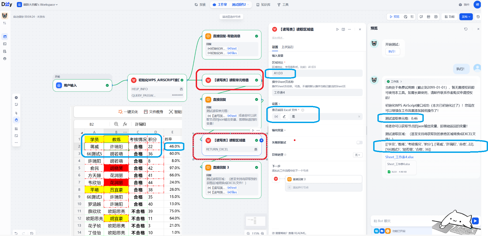
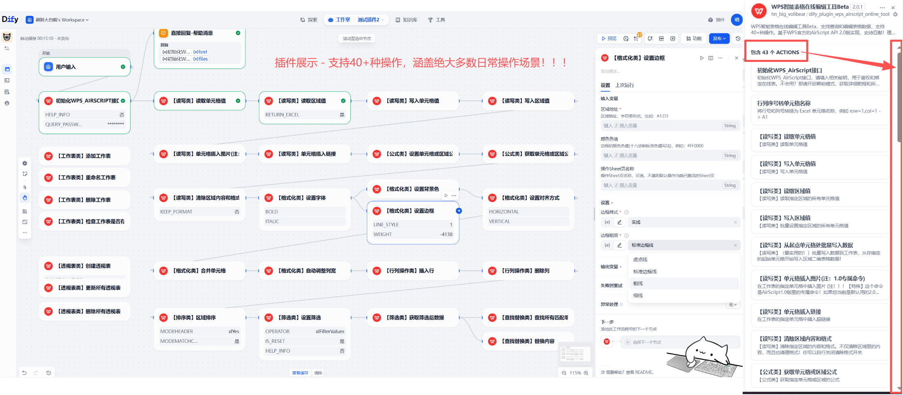

## dify_plugin_wps_airscript2.0_online_tool

**Author:** HnBigVolibear 湖南大白熊工作室

**Version:** 2.0.2

**Type:** tool

---

### Description

一个Dify插件 —— 基于WPS AirScript2.0设计的Python客户端，配合配套的JS，轻松实现WPS在线智能表格的各类读写操作，支持各类日常操作40+种，开箱即用！效率拉满！现在已经封装成Dify插件，方便直接在工作流里使用！轻松打通Dify与WPS的数据交互！拒绝数据孤岛！

### Usage

1. use and say: HnBigVolibear NewBee! HaHa~
2. 建议直接使用我打包好的Dify插件安装包.difypkg，直接安装即可使用！

### Quick Start Run this project:
- 注：python版本建议3.12及以上！并且你需要已经有一点Dify插件开发基础了！否则请直接使用本项目的Release发行版安装包.difypkg即可。
- 安装依赖：`pip install -r requirements.txt`
- 下载并解压本仓库，进入到当前`dify_plugin_wps_airscript_online_tool`文件夹（这才是插件本身的文件夹工程）
- 修改`.env`文件，填入你的Dify平台的插件调试密钥！
- 运行`python -m main.py`即可！回到Dify平台的插件页面，即可看到插件已经上线！

> **最后，可能有个注意点：**
我们制作的插件未经过dify审核，dify认为存在安全隐患，就不会允许我们上传到本地web里，因此，需要放开权限：
dify目录下的.env 配置文件的末尾添加：
FORCE_VERIFYING_SIGNATURE=false
即可。然后切记——重启dify。
注：如果不改这里，大概率就算你完成了插件开发，最后上传到web时也会报错：
PluginDaemonBadRequestError: plugin verification has been enabled, and the plugin you want to install has a bad signature

---

# ✨**手把手教你玩转WPS智能表格AirScript2.0在线读写操作工具！** 

---

## **📌 注意！请先确认你用的是 WPS 在线智能表格**
- 不是 WPS 普通在线表格！也不是 WPS 本地 Excel 文件！
- AirScript是使用2.0版本，而不是老的1.0版本！

> 这是一个使用Python编写的 简洁易用的 API 客户端工具，支持单元格读写、格式化设置、行列操作、查找替换、排序复制粘贴、工作表管理及批量数据处理等40+种常用功能！甚至可以实现按需筛选、增删改查数据透视表等复杂操作！开箱即用！几乎零依赖！

##### 顺便一提，如果你不是Dify用户，或者想直接纯python处理操作，那么可点击下面这里：
- 这是本Dify插件项目所基于的我的Python客户端项目，开箱即用，编写极简的python代码即可实现WPS在线智能表格的各类处理操作！
**👉 [配套的Python客户端项目](https://github.com/HnBigVolibear/wps_airscript2.0_online_tool)**

---

# 快速开始

## **🚀 一、准备阶段**
- 注：如果你已经熟知了AirScript2.0的日常使用，可以直接跳过此部分，直接看后面的 **🛠️ 二、开始使用插件** 部分！
#### 你需要准备以下三个必填参数：  
`file_id`、`token`、`script_id` 即：表格ID、脚本令牌、脚本ID。
#### 这是因为，工作流开始时，务必需要先用 **「初始化WPS_AirScript接口」** 节点连接你的在线表格！

---

### **📝 初始化步骤详解**

#### **1. 新建 WPS 智能表格**
- 访问 **[金山文档 | WPS 云文档官网](https://www.kdocs.cn/latest)**
- 点击左上角 **「新建」** → 选择 **「智能表格」**
- 🚨 **特别注意**：必须是 **智能表格**，不是普通表格！
- 你可以先重命名表格，并手动填入一些初始数据或模板数据

---

#### **2. 创建 AirScript 脚本**
- 点击网页顶部 **「效率」** → **「高级开发」** → **「AirScript 脚本编辑器」**
- 在弹窗左上角找到 **「文档共享脚本」** 右侧的 **▼** 下拉按钮
- 选择 **「AirScript 2.0」**，创建一个新脚本
注：创建 AirScript 2.0 版本的脚本，脚本名称块块右侧都会有个“Beta”标识！

---

#### **3. 粘贴本客户端配套 JS 脚本**
- 将本项目中的 `wps_airscript_client_api.js` 文件内容，直接全部复制粘贴到你刚创建的 AirScript 脚本编辑器中即可！
- 或通过初始化节点，开启帮助模式，即可直接输出该JS文件，下载获取即可！

---

#### **4. 获取 token令牌**
- 点击编辑器上方的 **「脚本令牌」** 按钮
- 生成并复制 `token`（令牌有效期为 **半年**，到期前可免费续期）
- ⚠️ 令牌过期会导致脚本报错！
- 每次需要提前去手动延期！延期可延长半年，无限延期，即实际上是永久免费的！

---

#### **5. 获取 file_id 和 script_id**
- 点击脚本名称右侧的 **「•••」** 按钮
- 选择 **「复制脚本 webhook」**
- 粘贴到文本框中，你会看到类似这样的链接： https://www.kdocs.cn/api/v3/ide/file/cnPc**nYee/script/V2-3hYQ****gHt5sB8l047/sync_task
##### 其中：
- `cnPc****nYee` 就是 **file_id** 表格ID
- `V2-3hYQ******gHt5sB8l047` 就是 **script_id** 脚本ID

---

#### **6. 开启表格分享**
- 关闭脚本编辑器，回到智能表格主界面
- 点击右上角 **「分享」** 按钮
- 打开 **「和他人一起查看/编辑」** 开关

---

## **🛠️ 二、开始使用插件**
> 记住：**任何工作流操作前，都必须先完成初始化！**

本插件提供以下常用功能模块，每个节点都有详细说明，请仔细阅读：

- 📄 **单元格读写操作**
- 🎨 **格式化设置**（字体、颜色、对齐、边框等）
- 🔢 **行列操作**（插入、删除、调整大小）
- 🔍 **查找和替换**
- 📊 **排序和复制粘贴**
- 📑 **工作表管理**
- ⚡ **批量数据处理**

#### **首先进行初始化**
- 回到插件中的 **「初始化WPS_AirScript接口」** 节点
- 填入刚才获取的 `file_id`、`token`、`script_id`
- 点击运行，成功后会返回提示
- ✅ **小提示**：初始化成功后，可以关闭该节点的 **「是否返回帮助信息」** 参数

---

#### **接下来你就可以随意使用任意操作节点块块了！**
请自行探索使用，每个节点的每个参数都有详细说明！
**请务必仔细阅读参数说明！请务必仔细阅读参数说明！请务必仔细阅读参数说明！**
**阅读理解不行的同学，建议回小学重修语文哦～** 😉 

---

## **📚 其他说明**
#### 参考链接 & 鸣谢：
- [WPS 智能表格 API 文档](https://www.kdocs.cn/l/cftIrDJVIvCU)
- [应道社区讨论](https://www.yingdao.com/community/detaildiscuss?id=885400393968951296)
- **WPS 官方 AirScript 文档**：[点击查看](https://airsheet.wps.cn/docs/apitoken/intro.html)

---

### **👨‍💻 联系我**
- 湖南大白熊工作室 
- https://github.com/HnBigVolibear
如有技术问题或改进建议，欢迎联系：  
📧 **1486203070@qq.com**

---

### Sponsor Me 捐赠我：

> 让数据流动起来，让表格变得更聪明！祝你使用愉快！ 🚀

---

### **📝 更新日志**

##### **v2.0.1**
- 2026-02-05上线，初始版本，提供常用功能模块，包括单元格读写、格式化设置、行列操作、查找和替换、排序和复制粘贴、工作表管理、批量数据处理等。
##### **v2.0.2**
- 2026-02-13更新，新增一个方法：获取已使用区域的位置范围。比如可以用于获取第一个可用行！